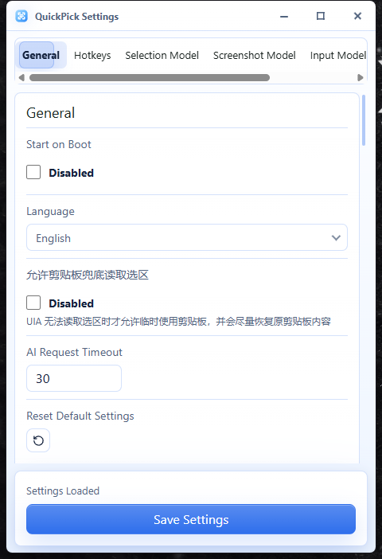
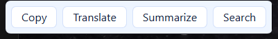
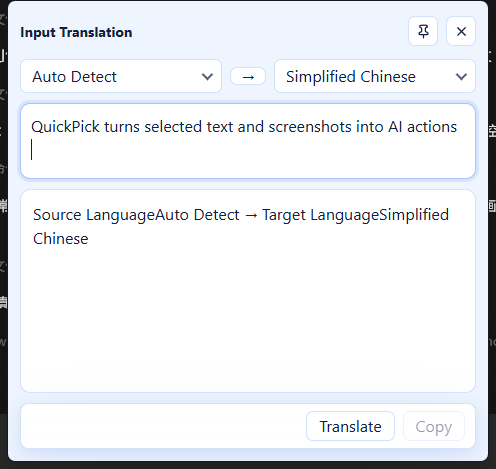

<div>
  
  <h1>QuickPick</h1>
  <p>A lightweight text selection and screenshot AI utility for Windows 11 and macOS</p>
</div>

[](https://github.com/udstd0038/quickpick/releases)
[](https://github.com/udstd0038/quickpick/actions/workflows/security-audit.yml)
[](https://github.com/udstd0038/quickpick/releases)

English | [简体中文](./README.zh-CN.md)

## Overview

QuickPick is a lightweight AI utility that stays in the system tray and works from anywhere on Windows 11. It turns selected text and screen regions into useful actions: copy, search, summarize, translate, OCR, or image translation through an OpenAI-compatible API.

The desktop app is built with Tauri 2, React, TypeScript, and Rust. The Rust side handles global hotkeys, tray integration, text selection, screenshots, encrypted API key storage, and AI requests. The React side renders the settings page and WebView popups with light and dark themes.

QuickPick keeps content local by default:

- Selected text, screenshots, and AI results are not saved as history.
- AI requests only start after the user explicitly triggers an action.
- API keys are encrypted locally with Windows DPAPI or macOS Keychain.

## Release Status

Current releases:

- Windows 11 v0.1.4 is the stable release.
- macOS v0.1.3-macos is a universal pre-release built from `feature/macos-port`.
- The macOS package is CI-verified but is not signed, not notarized, and has not completed manual acceptance on physical Mac hardware yet.

## Screenshots

The screenshots below were captured from the real QuickPick UI on Windows 11 in light theme.

### Settings



### Selection Menu



### Input Translation



## Features

- 🖱️ Selection menu for the current foreground window with copy, search, translate, and summarize actions.
- 🖼️ Region screenshot with copy, OCR text extraction, and image translation actions.
- ⌨️ Input translation window with source language, target language, direction, and `Ctrl+Enter` translation.
- 🧩 Independent selection model, screenshot model, and input model configuration.
- ⚙️ OpenAI-compatible provider presets including DeepSeek, Xiaomi MiMo, Kimi, GLM, MiniMax, and Qwen.
- 🤖 System tray integration, startup option, and globally registered hotkeys.
- 🌓 Light/dark themes, Acrylic/Mica window effects, and adjustable panel opacity.
- 🌍 UI languages for simplified Chinese, traditional Chinese, English, Korean, Japanese, French, German, and Spanish.
- 🔒 Local-first privacy: no text, screenshot, or AI history is stored by default.

## AI Model Settings

QuickPick separates AI credentials and model settings into three cards in the settings page:

| Card | Purpose |
|------|---------|
| Selection Model | Text translation and summarization from the selection menu |
| Screenshot Model | OCR and image translation from region screenshots |
| Input Model | Text translation from the input translation window |

Each card has independent provider, Base URL, model, and API key settings. Requests use the configured model only and never fall back to another card.

## Privacy

- QuickPick does not save selected text, screenshots, OCR output, translation output, or AI history.
- Clipboard content is only changed when the user clicks Copy.
- API keys are encrypted locally and are not written to logs or the repository.
- External AI endpoints must use HTTPS unless the address is local or on a private network.

## Installation

### Windows 11

Download the v0.1.4 stable release from the [Windows release page](https://github.com/udstd0038/quickpick/releases/tag/v0.1.4).

| Package | Recommendation |
|---------|----------------|
| [NSIS installer](https://github.com/udstd0038/quickpick/releases/download/v0.1.4/QuickPick_0.1.4_x64-setup.exe) | Use for a normal installation |
| [Portable ZIP](https://github.com/udstd0038/quickpick/releases/download/v0.1.4/QuickPick_0.1.4_x64-portable.zip) | Extract and run manually |

The installer prefers `D:\Program Files\QuickPick`. If drive D does not exist, it uses another non-system drive when available and falls back to `C:\Program Files\QuickPick`.

### macOS Pre-release

Download the [macOS universal DMG](https://github.com/udstd0038/quickpick/releases/download/v0.1.3-macos/QuickPick_0.1.3_universal.dmg) from the [macOS release page](https://github.com/udstd0038/quickpick/releases/tag/v0.1.3-macos).

This package is unsigned and not notarized yet. Gatekeeper may ask you to right-click Open or approve it in Privacy & Security before it starts.

### First Run

QuickPick stays silent in the system tray after startup. Configure at least the AI model card you plan to use before starting a request.

Default Windows hotkeys:

| Action | Hotkey |
|--------|--------|
| Settings | `Alt+0` |
| Selection menu | `Alt+2` |
| Region screenshot | `Alt+3` |
| Input translation | `Alt+4` |

macOS default hotkeys on the pre-release branch use `Command+,` for Settings and `Command+Option+2`, `Command+Option+3`, and `Command+Option+4` for Selection, Region Screenshot, and Input Translation.

## Development

Development requires Node.js 22 or later and pnpm. Use the pnpm version specified by the `packageManager` field in `package.json`.

```bash
git clone https://github.com/udstd0038/quickpick.git
cd quickpick

pnpm install
pnpm test
pnpm desktop:dev
```

Build the Windows release with NSIS:

```powershell
pnpm --filter quickpick-desktop exec tauri build --bundles nsis --ci --no-sign
```

Build a macOS universal package on macOS:

```bash
pnpm --filter quickpick-desktop exec tauri build --target universal-apple-darwin --bundles dmg --ci --no-sign
```

The screenshot capture helper is available at `tools/capture-readme-screenshots.ps1`.

## Tech Stack

| Area | Stack |
|------|-------|
| Desktop shell | Tauri 2 |
| System layer | Rust |
| UI | React 19 + TypeScript + Tailwind CSS + Vite |
| UI icons | lucide-react |
| Screenshot capture | xcap |
| AI transport | OpenAI-compatible HTTP APIs |
| Secret storage | Windows DPAPI and macOS Keychain |
| Automation | Tauri global shortcuts, Windows UI Automation, macOS Accessibility |
| Testing | Vitest, Rust unit tests, GitHub Actions |

The frontend renders the settings page and WebView popups. Rust owns the OS-facing capabilities and AI request flow.

## Contributing

Contributions, bug reports, translations, and design feedback are welcome. Before opening a pull request, read [CONTRIBUTING.md](./CONTRIBUTING.md), [AGENT.md](./AGENT.md), and the project documents under [docs/](./docs). The repository keeps current progress and decisions in [dev-logs/](./dev-logs).

Do not add API keys, selected text, screenshots, or AI response contents to commits, logs, issues, or CI artifacts.

## Contributors

- [@udstd0038](https://github.com/udstd0038) - maintainer

See [CONTRIBUTORS.md](./CONTRIBUTORS.md) for the contributor list.

## Security

For vulnerability reporting and supported versions, read [SECURITY.md](./SECURITY.md). Do not disclose exploitable security issues in public GitHub issues.

## License

[MIT](./LICENSE) © 2026 QuickPick contributors
