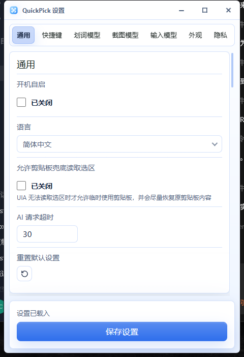
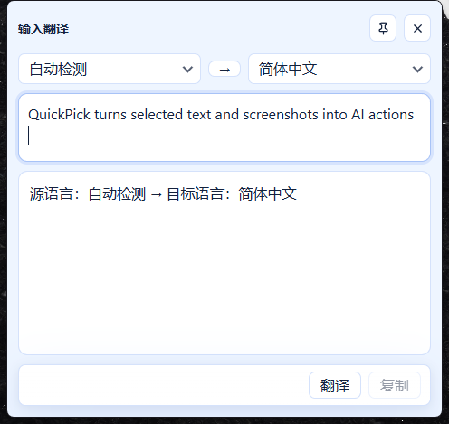

<div>
  
  <h1>QuickPick</h1>
  <p>运行在 Windows 11 与 macOS 上的轻量级划词与截图 AI 工具</p>
</div>

[](https://github.com/udstd0038/quickpick/releases)
[](https://github.com/udstd0038/quickpick/actions/workflows/security-audit.yml)
[](https://github.com/udstd0038/quickpick/releases)

[English](./README.md) | 简体中文

## 简介

QuickPick 是一款轻量级 AI 工具，常驻 Windows 11 系统托盘，可以在任意软件中处理当前选中的文本或截取的屏幕区域。它把常用操作集中到快捷键和轻量弹窗中：复制、搜索、翻译、总结、截图文字提取和图片翻译，均通过 OpenAI 兼容接口完成。

项目使用 Tauri 2、React、TypeScript 和 Rust 构建。Rust 负责全局快捷键、托盘、选区读取、截图、API Key 加密保存和 AI 请求；React 负责设置页与 WebView 弹窗，并支持浅色和深色主题。

QuickPick 默认坚持本地优先：

- 不把选中文本、截图和 AI 结果保存为历史记录。
- 只有用户明确触发操作后才发起 AI 请求。
- API Key 在 Windows 使用 DPAPI、在 macOS 使用 Keychain 本地加密保存。

## Release 状态

当前发布状态：

- Windows 11 v0.1.4 为正式版本。
- macOS v0.1.3-macos 是基于 `feature/macos-port` 的 universal 预发布版本。
- macOS 包已通过 CI universal 构建，但尚未签名、未公证，也尚未在实体 Mac 上完成人工验收。

## 应用截图

以下截图来自 Windows 11 下真实运行的 QuickPick 浅色界面。

### 设置页



### 划词菜单


### 输入翻译



## ✨ 主要功能

- 🖱️ 划词菜单：对当前前台应用中的选中文本执行复制、搜索、翻译和总结。
- 🖼️ 区域截图：框选屏幕区域后可复制图片、提取文字或翻译图片中的文字。
- ⌨️ 输入翻译：支持源语言、目标语言和翻译方向切换，可用 `Ctrl+Enter` 发起翻译。
- 🧩 三套独立 AI 配置：划词模型、截图模型和输入模型分别保存供应商、Base URL、模型与 API Key。
- ⚙️ OpenAI 兼容供应商预设：支持 DeepSeek、小米 MiMo、Kimi、GLM、MiniMax、Qwen 等。
- 🤖 系统托盘、开机自启和全局快捷键。
- 🌓 浅色/深色主题、Acrylic/Mica 窗口效果和不透明度调节。
- 🌍 界面支持简体中文、繁体中文、英文、韩文、日文、法文、德文和西班牙文。
- 🔒 本地隐私优先：默认不保存文本、截图和 AI 结果历史。

## AI 模型配置

设置页为不同 AI 能力提供独立配置卡片：

| 卡片 | 用途 |
|------|------|
| 划词模型 | 处理划词翻译、总结等文本任务 |
| 截图模型 | 处理截图文字提取和图片翻译等视觉任务 |
| 输入模型 | 处理输入翻译窗口的文本任务 |

每张卡片拥有独立的供应商、Base URL、模型和 API Key。请求只使用对应卡片中的配置，不互相回退。

## 隐私

- 不自动保存划词文本、截图、OCR 输出、翻译结果或 AI 请求历史。
- 剪贴板内容只在用户明确点击复制后修改。
- API Key 本地加密保存，不写入开发日志或仓库。
- 外部 AI 服务默认必须使用 HTTPS；HTTP 仅允许本地或私有网络地址。

## 📦 安装

### Windows 11

请从 [Windows Release 页面](https://github.com/udstd0038/quickpick/releases/tag/v0.1.4) 下载 v0.1.4 正式版本。

| 安装包 | 推荐用途 |
|--------|----------|
| [NSIS 安装包](https://github.com/udstd0038/quickpick/releases/download/v0.1.4/QuickPick_0.1.4_x64-setup.exe) | 常规安装 |
| [便携 ZIP](https://github.com/udstd0038/quickpick/releases/download/v0.1.4/QuickPick_0.1.4_x64-portable.zip) | 解压后直接运行 |

安装程序默认优先选择 `D:\Program Files\QuickPick`；没有 D 盘时选择其他非系统盘，只有 C 盘时回退到 `C:\Program Files\QuickPick`。

### macOS 预发布

请从 [macOS Release 页面](https://github.com/udstd0038/quickpick/releases/tag/v0.1.3-macos) 下载 [macOS universal DMG](https://github.com/udstd0038/quickpick/releases/download/v0.1.3-macos/QuickPick_0.1.3_universal.dmg)。

该包尚未签名和公证，Gatekeeper 可能要求右键“打开”或在“隐私与安全性”中允许后才能启动。

### 首次使用

QuickPick 启动后默认静默驻留系统托盘。使用前请先在设置页中配置要使用的 AI 模型。

Windows 默认快捷键：

| 功能 | 快捷键 |
|------|--------|
| 设置 | `Alt+0` |
| 划词菜单 | `Alt+2` |
| 区域截图 | `Alt+3` |
| 输入翻译 | `Alt+4` |

macOS 预发布分支默认使用 `Command+,` 打开设置，使用 `Command+Option+2`、`Command+Option+3` 和 `Command+Option+4` 分别呼出划词、区域截图和输入翻译。

## 🛠 开发与构建

开发前请安装 Node.js 22+ 和 pnpm，pnpm 版本以 `package.json` 中的 `packageManager` 字段为准。

```bash
git clone https://github.com/udstd0038/quickpick.git
cd quickpick

pnpm install
pnpm test
pnpm desktop:dev
```

构建 Windows NSIS 安装包：

```powershell
pnpm --filter quickpick-desktop exec tauri build --bundles nsis --ci --no-sign
```

在 macOS 上构建 universal DMG：

```bash
pnpm --filter quickpick-desktop exec tauri build --target universal-apple-darwin --bundles dmg --ci --no-sign
```

README 截图生成脚本位于 `tools/capture-readme-screenshots.ps1`。

## 🔧 技术栈

| 领域 | 选型 |
|------|------|
| 桌面 shell | Tauri 2 |
| 系统层 | Rust |
| 界面 | React 19 + TypeScript + Tailwind CSS + Vite |
| 图标 | lucide-react |
| 截图捕获 | xcap |
| AI 调用 | OpenAI 兼容 HTTP API |
| 密钥存储 | Windows DPAPI、macOS Keychain |
| 自动化 | Tauri global shortcuts、Windows UI Automation、macOS Accessibility |
| 测试与 CI | Vitest、Rust 单元测试、GitHub Actions |

前端负责设置页与 WebView 弹窗；Rust 负责贴近操作系统的能力、AI 请求和敏感状态管理。

## 🤝 参与贡献

欢迎提交代码、Issue、翻译和设计建议。创建 Pull Request 前请先阅读 [CONTRIBUTING.md](./CONTRIBUTING.md)、[AGENT.md](./AGENT.md) 和 [docs/](./docs) 下的项目文档，并查看 [dev-logs/](./dev-logs) 了解当前进度与决策。

请勿把 API Key、用户文本、截图内容或 AI 返回全文写入提交、日志、Issue 或 CI 产物。

## 👥 贡献者

- [@udstd0038](https://github.com/udstd0038) - 维护者

贡献者名单详见 [CONTRIBUTORS.md](./CONTRIBUTORS.md)。

## 🔐 安全

漏洞报告方式与支持版本请阅读 [SECURITY.md](./SECURITY.md)。请勿在公开 Issue 中披露可直接利用的安全问题。

## 📜 许可

[MIT](./LICENSE) © 2026 QuickPick contributors
